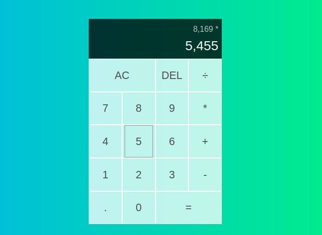

# Тестовое задание от компании "Smart code" по вакансии "Frontend-разработчик"

Требования:
1. Написать SPA, руководствуясь макетом на картинке.
2. Приложение должно полноценно выполнять свою функцию - считать!
3. Использование библиотеки React.js

Желательно:
1. Использование MobX (даже если не знакомы - лучше бегло изучить и применить. Даст понимание насколько быстро вы готовы и можете учиться).
2. Использование TypeScript.
3. Писать красиво и локанично (CleanCode).
4. Проявить инициативу, добавить рассчет %.

Это моё первое знакомство с MobX. 
Кроме TypeScript, все прочие пункты в готовом ТЗ соблюдены.